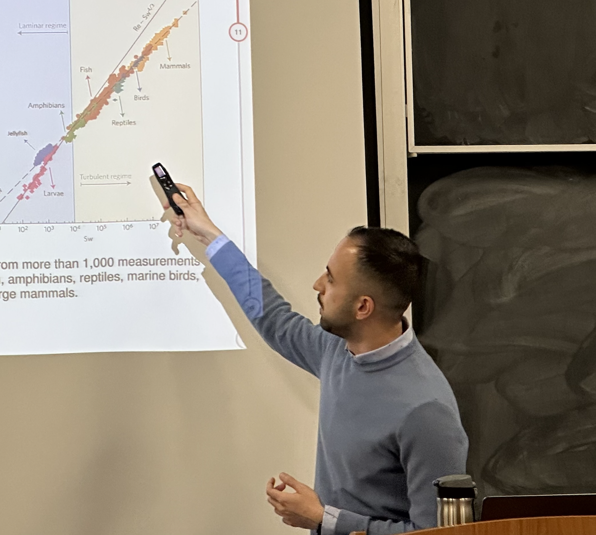

<h2>About Me</h2>

<!-- Top row: photo + links -->

  <!-- Image -->
  

    
  

  <!-- Links -->
  

    

      <a href="https://scholar.google.com/citations?user=wQ4KU-YAAAAJ&hl=en"
         target="_blank"
         style="text-decoration: none; color: #268bd2;">
        Google Scholar
      </a>
    

    

      <a href="CV.pdf"
         target="_blank"
         style="text-decoration: none; color: #268bd2;">
        Academic CV
      </a>
    

  

<!-- Full-width About Me text -->

  Welcome to my corner of the internet! I'm currently immersed in the world of academia as a Ph.D. candidate in the Mathematics Department at Simon Fraser University. Under the guidance of esteemed advisors,
  <a href="https://www.sfu.ca/~jstockie/" target="_blank" style="text-decoration: none; color: #268bd2;">Dr. John Stockie</a>
  and
  <a href="https://amacp.github.io" target="_blank" style="text-decoration: none; color: #268bd2;">Dr. Ailene MacPherson</a>,
  I'm passionately delving into research at the intersection of epidemiology, evolutionary ecology, and theoretical biology, with a focus on applying evolutionary ecology principles to better understand bark beetle outbreaks and seed masting dynamics.

---
 

<h2> Education </h2>

  <h3 style="font-size:1.1em; font-weight: bold; margin-bottom: 0.2em;">
    Ph.D. in Applied Mathematics, 
    Simon Fraser University, BC, Canada (2023 – Present)
  </h3>
  

    <strong>Focus:</strong> Evolutionary ecology applied to bark beetle outbreaks and seed masting 
    <strong>Advisors:</strong> Dr. A. MacPherson & Dr. John M. Stockie
  

  <h3 style="font-size:1.1em; font-weight: bold; margin-bottom: 0.2em;">
    MSc. in Applied Mathematics, 
    Simon Fraser University, BC, Canada (2021 – 2022)
  </h3>
  

    <strong>Thesis:</strong> Computational Study of 2D Jellyfish with the Immersed Boundary Method [<a href="https://summit.sfu.ca/item/35829" target="_blank" style="text-decoration: none; color: #268bd2;">SFU Library</a>] 
    <strong>Advisors:</strong> Dr. John M. Stockie
  

  <h3 style="font-size:1.1em; font-weight: bold; margin-bottom: 0.2em;">
    BSc. in Computer Science, 
    Amirkabir University of Technology, Tehran, Iran (2015 – 2019)
  </h3>
  

    <strong>Project:</strong> Cardinality Optimization: Focusing on Cardinality Constrained Problems 
    <strong>Advisors:</strong> Dr. S. A. Mirhassani
  

